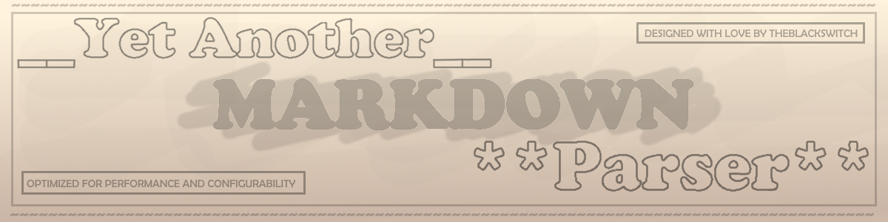

   

## Introduction
YAMP is a lightweight markdown parser focused on live in-text parsing. It's designed for [Infill](https://github.com/TheBlackSwitch/infill) a live in-text mardown editor. 

It comes with all basic markdown syntax plus built-in char map generation which maps each character in the visible html an traces it back to the original markdown.

Since it's designed for in-text parsing, the parser **doesn't** closely follow the CommonMark specifications as they aren't always intuitive for an in-text editor. Most of these are full intended to make writing easier for the user.

## Table of contents
- [Design](#design)
- [Features](#features)
  - [Standard markdown syntax](#standard-markdown-syntax)
  - [Extended markdown syntax](#extended-markdown-syntax)
  - [Infill specific syntax](#infill-specific-syntax)
  - [Extras](#extras)
- [License](#license)

### Design 
The project is designed in such a way that it's both really easy to extend and create custom syntax whilst parsing within microseconds!

**Pros**:
- Configurable
- Extensable
- High performance due to extensive caching and single-pass parsing
- Simplicty

**Cons**:
- Doesn't colsely match common mark
- HTML can't span across multiple lines (I still need to fix this but it's a lot of work)

## Features

All features below can be turned on / off. Some of them may even have some more options.

### Standard markdown syntax
- Headers
```md
# header 1
### header 3
```
- Alternate Headers
```md
Header 1
========
```
- Block Quotes
```md
> Block Quotes
```
- Emphasis
```md
*italic* **bold** ***both***
```
- Underscore Emphasis
```md
_italic_ __bold__ ___both___
```
- Lists
```md
- unordered
  - sublists

1. ordered
  2. sub lists

- merged 
  1. ordered
  - unordered
```
- Code
```md
`code` `` `escaped` ``
```
- Links
```md
[My Website](https://theblackswitch.com "This is a title")
```
- Images
```md

```
- Horizontal Rules
```md
---
***
___
```
### Extended markdown syntax
- Strikethrough
```md
This parser is really ~~bad~~ awesome!
```
- Github Style Codeblocks
```md
\```js
   conole.log('Hello World');
\```
```
- Tables
```md
| Product | Price  | Provider   | Delivery Date | Additional Notes      |
|---------|--------|------------|---------------|-----------------------|
| Jeans   | $34.99 | Jack&Jones | 4/08/2026     | Color: Blue           |
| T-Shirt | $2.95  | Shein      | 7/08/2026     | Child labour included |
```

### Infill Specific Syntax
- Colored text
```md
Remeber to drink enough [blue|water] otherwise you'll be [#AAFFAA|Sick]!
```
- Highlights
```md
This is ^very^ important
These are escaped: ^^ ^<^ ^^
```
- Underlined
```md
This is ==also== important
```

### Extras
- **Charmap generation**:<br>
An array that maps each visible html character to their corresponding markdown character. This is useful for selecting / copying the correct underlying markdown characters

- **Escape incomplete HTML**:<br>
Escapes any incomplete html. This includes unclosed tags ``<div``, faulty attributes ``<div class=">``, lost close tags ``</div>``, open tags without close tags ``<div>`` or even faulty html entities ``&copy``<br><br>
This feature also makes sure the charmap is kept aligned when any text is getting parsed as HTML.

  > [!INFO]
  > Html currently **cannot** cross multiple lines. I should still fix this but it's a lot of work


- **Replace spaces with ``&nbsp;``**<br>
Yup this does exactly what you'd expect. Anyways this makes spaces actually stack

- **Add zero width spaces for cursors**: <br>
This allows you to detect cursor positions easier. For example on empty lines, you can't detect cursor positions if there is no character there. This option will place a zero width space there so you can still click

## 📜License

___
YAMP &copy; 2026 by theblackswitch is licensed under GPL v3.0.

**Additional condition**: The content of this work, as a whole or in parts, may **not** be used for training, fine-tuning, or enhancement of artificial intelligence systems, machine learning models or any other type of program where computers use data and algorithms to learn patterns and make predictions without being explicitly programmed. This includes, not only and all, for commercial, non-commercial, educational, research, or personal projects.
___

